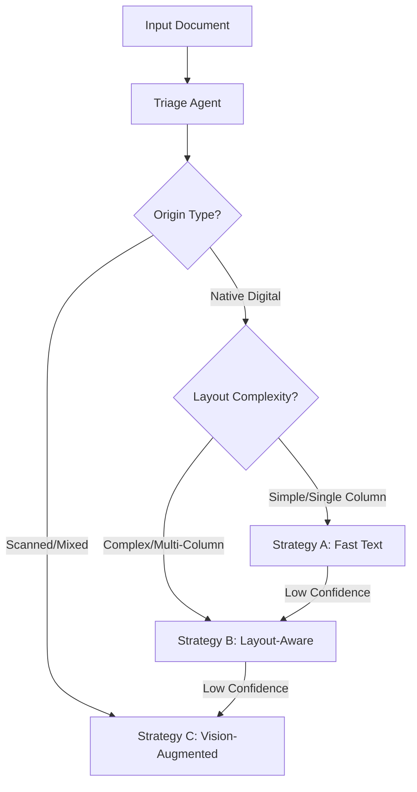
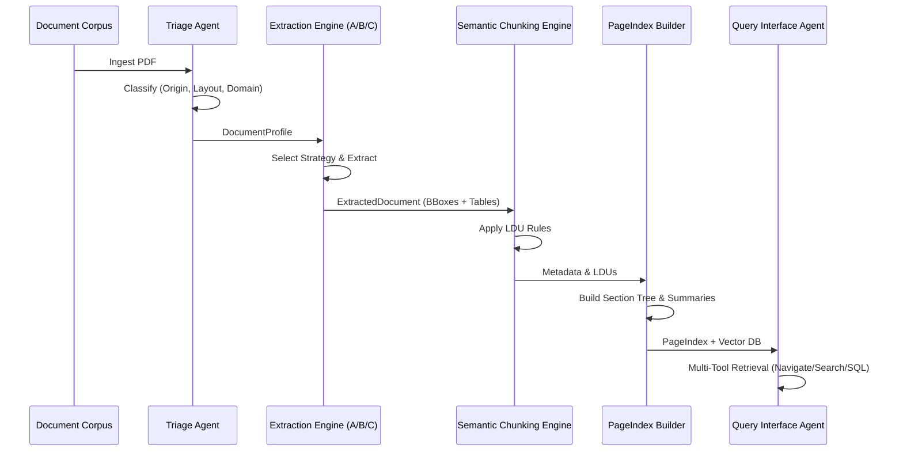

# DOMAIN_NOTES.md: Document Intelligence Refinery

This document outlines the conceptual foundation and technical strategy for the Document Intelligence Refinery, focusing on the transition from raw document extraction to structured knowledge.

## Extraction Strategy Decision Tree

The system uses a tiered approach to balance cost and quality:

### Strategy Tiers
1.  **Strategy A (Fast Text)**: Uses `pdfplumber` for character stream extraction. Fast and cheap. Ideal for non-complex digital PDFs.
2.  **Strategy B (Layout-Aware)**: Uses `Docling` or `MinerU`. Recovers structure (tables, columns, reading order). Moderate cost/latency.
3.  **Strategy C (Vision-Augmented)**: Uses Multimodal LLMs (Gemini Pro Vision, etc.). High fidelity for scanned or extremely complex layouts. Expensive.

---

## Failure Modes & Mitigation

| Failure Mode | Cause | Mitigation |
| :--- | :--- | :--- |
| **Structure Collapse** | Naive OCR flattening multi-column text. | Use Layout-Aware (Docling/MinerU) or Vision-Augmented extraction. |
| **Context Poverty** | Random chunking breaking table rows/captions. | Implement Semantic Chunking (LDU) rules. |
| **Provenance Blindness** | Loss of spatial coordinates during parsing. | Track bounding boxes (BBox) and page refs in every LDU. |
| **Hallucination** | LLM reasoning on corrupted/noisy OCR text. | Escalation Guard: Trigger Vision Extraction if OCR confidence is low. |

---

## Pipeline Architecture (The Refinery)

